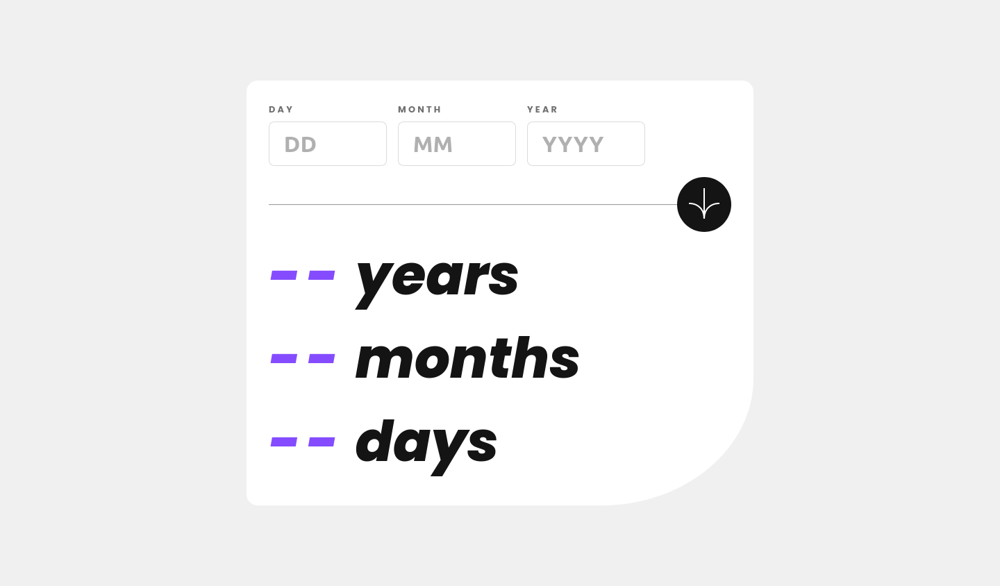

# Frontend Mentor - Age calculator app solution

This is a solution to the [Age calculator app challenge on Frontend Mentor](https://www.frontendmentor.io/challenges/age-calculator-app-dF9DFFpj-Q). Frontend Mentor challenges help you improve your coding skills by building realistic projects.

## Table of contents

- [Overview](#overview)
  - [The challenge](#the-challenge)
  - [Screenshot](#screenshot)
  - [Links](#links)
- [My process](#my-process)
  - [Built with](#built-with)
  - [What I learned](#what-i-learned)
- [Author](#author)

## Overview

### The challenge

Users should be able to:

- View an age in years, months, and days after submitting a valid date through the form
- Receive validation errors if:
  - Any field is empty when the form is submitted
  - The day number is not between 1-31
  - The month number is not between 1-12
  - The year is in the future
  - The date is invalid e.g. 31/04/1991 (there are 30 days in April)
- View the optimal layout for the interface depending on their device's screen size
- See hover and focus states for all interactive elements on the page
- **Bonus**: See the age numbers animate to their final number when the form is submitted

### Screenshot



### Links

- Solution URL: [Add solution URL here](https://your-solution-url.com)
- Live Site URL: [Add live site URL here](https://your-live-site-url.com)

## My process

### Built with

- CSS modules
- Mobile-first workflow
- [React](https://reactjs.org/) - JS library
- [Next.js](https://nextjs.org/) - React framework

### What I learned

While I was working on the app, I noticed I was using several states and fill my index file with a lot of repeated code. After looking for a better approach, I found the option to
create my own custom hooks to handle the validation logic. This an example to validate if a user entered a valid day for the month.

```js
import { useState } from 'react'

export function useValidateDayInMonth () {
  const [error, setError] = useState('')
  const [isError, setIsError] = useState(false)

  const isValidDayInMonth = (day, month) => {
    const daysInMonth = new Date(new Date().getFullYear(), month, 0).getDate()
    if (day > daysInMonth && day <= 31) {
      setError('The day is not valid')
      setIsError(true)
    } else {
      setError('')
      setIsError(false)
    }
  }

  return { error, isError, isValidDayInMonth }
}
```

## Author

- Website - [ArthurGC](https://github.com/ArthurGC)
